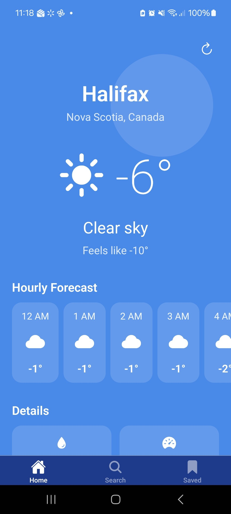
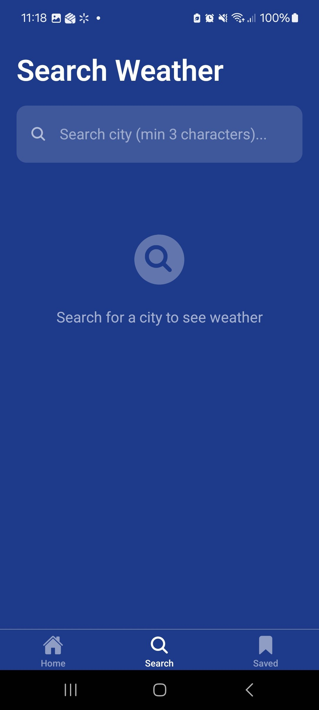
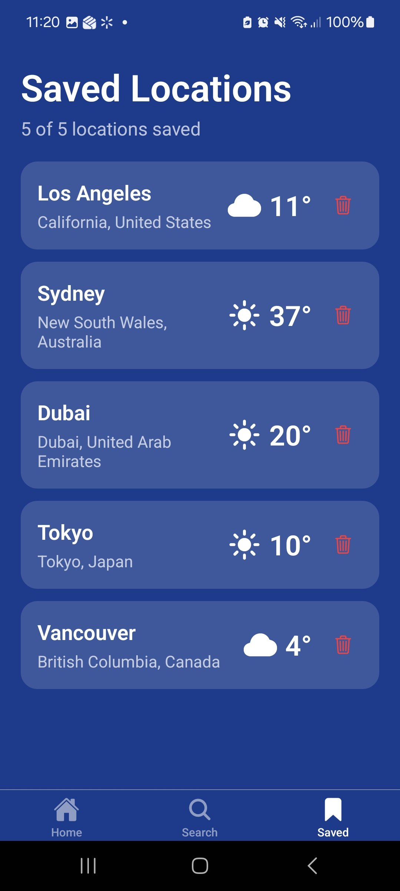

# React Native Weather App

A full-featured weather application built with **React Native** and **Expo**.
Displays real-time weather, hourly forecasts, and lets users search and save
locations. Weather data is powered by the free **Open-Meteo API** — no API key
required.

---

## Screenshots

> Add screenshots to a `screenshots/` folder and update the paths below.

| Home                          | Search                            | Saved                           |
| ----------------------------- | --------------------------------- | ------------------------------- |
|  |  |  |

To add screenshots:

1. Run the app on a device or emulator.
2. Take screenshots and save them as `screenshots/home.png`, `screenshots/search.png`, `screenshots/saved.png`.
3. Commit and push — the table above will render automatically on GitHub.

---

## Features

- 📍 **Auto-detects current location** via `expo-location`
- 🌡️ **Current weather** — temperature, feels-like, condition, wind, humidity
- 🕐 **24-hour hourly forecast** — horizontal scrollable list
- 🌅 **Sunrise / sunset** times
- 🔍 **Live city search** — debounced, triggers after 3 characters
- 💾 **Save up to 5 locations** — persisted with SQLite across app launches
- 🔄 **Pull-to-refresh** on all screens
- 🎨 **Animated backgrounds** that react to weather conditions

---

## Screens

### Screen 1 — Home (Current Location Weather)

- Requests location permission on launch; falls back to **Halifax, NS** if denied
- Shows current temperature, "feels like", weather condition icon and label
- Animated background (rain, snow, clear, cloudy) powered by `react-native-reanimated`
- Hourly forecast for the next 24 hours
- Weather details: humidity, wind speed, precipitation probability, sunrise/sunset
- Pull-to-refresh

### Screen 2 — Search & Display Weather

- Live search with Open-Meteo Geocoding API (min 3 characters, 500 ms debounce)
- Tap a suggestion to load full weather for that city
- **Save Location** button — disabled automatically when:
  - 5 locations are already saved ("Limit Reached (5/5)")
  - The current city is already saved ("Already Saved")
- "Saved: X / 5" counter shown below the button
- Errors surfaced via Alert dialogs

### Screen 3 — Saved Locations

- Lists all saved cities (up to 5) with live current weather
- Pull-to-refresh to update all saved locations
- Remove a location with a confirmation dialog
- Count shown in header ("X of 5 locations saved")
- Data persists across app restarts via SQLite

---

## Technology Stack

| Category    | Library / Version                    |
| ----------- | ------------------------------------ |
| Framework   | Expo SDK ~52.0.0                     |
| Language    | TypeScript                           |
| Navigation  | expo-router ~4.0.0 (file-based tabs) |
| Location    | expo-location ~18.0.0                |
| Storage     | expo-sqlite ~15.0.0                  |
| Animations  | react-native-reanimated ~3.16.1      |
| Icons       | @expo/vector-icons (Ionicons)        |
| Formatter   | Prettier ^3.3.3                      |
| Weather API | Open-Meteo (free, no key required)   |

---

## APIs Used

### 1. Geocoding API — City Search

```
GET https://geocoding-api.open-meteo.com/v1/search
    ?name={CITY}&count=8&language=en&format=json
```

Returns up to 8 city matches with name, latitude, longitude, country, and region.

### 2. Forecast API — Weather Data

```
GET https://api.open-meteo.com/v1/forecast
    ?latitude={lat}
    &longitude={lon}
    &current=temperature_2m,apparent_temperature,weather_code,wind_speed_10m,relative_humidity_2m
    &hourly=temperature_2m,apparent_temperature,weather_code,precipitation_probability,wind_speed_10m,relative_humidity_2m
    &daily=sunrise,sunset,weather_code,temperature_2m_max,temperature_2m_min
    &timezone=auto
```

Returns current conditions, hourly data for the next 7 days, and daily summaries.

---

## Storage — expo-sqlite

### Table Schema

```sql
CREATE TABLE saved_locations (
  id         INTEGER PRIMARY KEY AUTOINCREMENT,
  name       TEXT    UNIQUE NOT NULL,
  latitude   REAL    NOT NULL,
  longitude  REAL    NOT NULL,
  country    TEXT    NOT NULL,
  admin1     TEXT,
  created_at TEXT    NOT NULL
);
```

### Platform Support

| Platform | Storage                                                                    |
| -------- | -------------------------------------------------------------------------- |
| iOS      | Full SQLite — persistent across launches                                   |
| Android  | Full SQLite — persistent across launches                                   |
| Web      | **Not supported** — falls back to in-memory storage (data lost on refresh) |

---

## Weather Code Mapping (WMO)

| Code(s) | Condition     | Ionicons name  | Background |
| ------- | ------------- | -------------- | ---------- |
| 0–1     | Clear sky     | `sunny`        | clear      |
| 2       | Partly cloudy | `partly-sunny` | cloudy     |
| 3       | Overcast      | `cloudy`       | cloudy     |
| 45, 48  | Fog           | `cloud`        | cloudy     |
| 51–57   | Drizzle       | `rainy`        | rain       |
| 61–67   | Rain          | `rainy`        | rain       |
| 71–77   | Snow          | `snow`         | snow       |
| 80–82   | Rain showers  | `rainy`        | rain       |
| 85–86   | Snow showers  | `snow`         | snow       |
| 95–99   | Thunderstorm  | `thunderstorm` | rain       |

Full mapping in [`src/utils/weatherCodes.ts`](src/utils/weatherCodes.ts).

---

## Project Structure

```
ReactNativeWeatherApp/
├── app/
│   ├── _layout.tsx              # Root layout — DB initialisation
│   └── (tabs)/
│       ├── _layout.tsx          # Tab bar configuration
│       ├── index.tsx            # Screen 1: Current Location Weather
│       ├── search.tsx           # Screen 2: Search & Display Weather
│       └── saved.tsx            # Screen 3: Saved Locations
├── src/
│   ├── api/
│   │   └── openMeteo.ts         # Open-Meteo API (geocoding + forecast)
│   ├── components/
│   │   ├── AnimatedBackground.tsx
│   │   ├── AnimatedWeatherIcon.tsx
│   │   ├── HourlyForecast.tsx
│   │   ├── LocationCard.tsx
│   │   ├── WeatherDetails.tsx
│   │   └── WeatherHeader.tsx
│   ├── db/
│   │   └── sqlite.ts            # SQLite CRUD operations
│   ├── hooks/
│   │   └── useDebounce.ts       # Debounce hook for search input
│   └── utils/
│       └── weatherCodes.ts      # WMO code → icon + label + background
├── assets/
│   └── weather/                 # Local weather icon images
├── screenshots/                 # Add app screenshots here
├── .prettierrc
├── .prettierignore
├── app.json
├── babel.config.js
├── package.json
└── tsconfig.json
```

---

## Installation & Running

### Prerequisites

- Node.js v16+
- **Expo Go** on your device:
  [iOS App Store](https://apps.apple.com/app/expo-go/id982107779) |
  [Google Play](https://play.google.com/store/apps/details?id=host.exp.exponent)

### Steps

```bash
# 1. Install dependencies
npm install

# 2. Start the dev server
npx expo start

# 3. Scan the QR code with Expo Go (Android) or Camera app (iOS)
```

### Platform-specific commands

```bash
npm run android   # USB-connected Android device or emulator
npm run ios       # iOS Simulator (macOS + Xcode required)
npm run web       # Browser — limited (SQLite not supported on web)
```

### Code Formatting

```bash
npm run format        # Format all files with Prettier
npm run format:check  # Check formatting without writing
```

---

## Tested On

| Environment                                              | Status                            |
| -------------------------------------------------------- | --------------------------------- |
| Expo Go on Android physical device (Samsung Galaxy A52s) | ✅ Tested                         |
| Expo Go on Android Emulator (Android Studio)             | ✅ Tested                         |
| Expo Go on iOS physical device                           | _(placeholder — add your device)_ |
| iOS Simulator (Xcode)                                    | _(placeholder — add if tested)_   |

---

## Design Decisions

| Decision                         | Rationale                                                  |
| -------------------------------- | ---------------------------------------------------------- |
| Fallback location: Halifax, NS   | Canadian university context (SMU)                          |
| Debounce: 500 ms                 | Balances UX responsiveness and API efficiency              |
| Max 5 saved locations            | Prevents DB bloat; keeps UI manageable                     |
| Temperature in °C                | Default Open-Meteo unit; appropriate for Canadian audience |
| Open-Meteo API                   | Free, no API key, reliable, CORS-friendly                  |
| Ionicons for weather             | Built into Expo; covers all WMO weather conditions         |
| Save button disabled proactively | Better UX — user sees limit before attempting save         |

---

## Troubleshooting

| Issue                       | Fix                                                        |
| --------------------------- | ---------------------------------------------------------- |
| Location not detected       | Enable device location services and grant app permission   |
| App shows Halifax weather   | Location permission denied — grant it in device Settings   |
| Save button always disabled | You have 5 saved locations — remove one in the Saved tab   |
| Database errors (iOS)       | Reset simulator or clear app data                          |
| Database errors (Android)   | Clear app data in device Settings                          |
| Build / bundler errors      | Run `npm install`, then `npx expo start -c` to clear cache |
| Expo Go version mismatch    | Install the recommended Expo Go version when prompted      |

---

## External Resources & Credits

### Weather Data

- **[Open-Meteo](https://open-meteo.com/)** — Free, open-source weather API
- License: [CC BY 4.0](https://creativecommons.org/licenses/by/4.0/)

### Icons

- **[@expo/vector-icons](https://icons.expo.fyi/)** (Ionicons set)
  — Bundled with Expo; MIT License

### Weather Icon Images (`assets/weather/`)

> **TODO:** Fill in the source and license for the weather icon images stored
> in `assets/weather/`. If you generated them or they are original artwork,
> note that here. Example format:
>
> - **Source:** [Iconscout Free Weather Flat Icon Pack](https://iconscout.com/free-icon-pack/free-weather-flat-icon-pack_1002)
> - **Author:** Iyikon
> - **License:** [Free for personal & commercial use — check Iconscout terms](https://iconscout.com/licenses)

### Framework & Libraries

- **[Expo](https://expo.dev/)** — MIT License
- **[React Native](https://reactnative.dev/)** — MIT License
- **[react-native-reanimated](https://docs.swmansion.com/react-native-reanimated/)** — MIT License

---

## License

This project was created for educational purposes as part of **MCDA5550**
coursework at Saint Mary's University.

For the MIT License template, see: https://choosealicense.com/licenses/mit/
